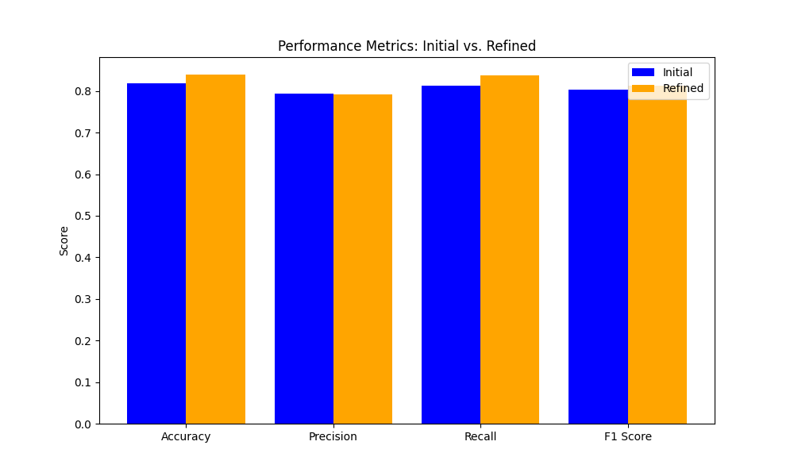

# AI Agents with Question-Answering

## Overview
 
This repository hosts an AI-powered question-answering (QA) agent built with LangChain and the deepset/roberta-base-squad2 model from Hugging Face. Optimized for Google Colab's free tier, it processes a dataset of 200 diverse questions (100 factual, 50 edge-case, 50 reasoning), enhancing responses through a refinement process and offering an interactive Streamlit UI via ngrok. The project demonstrates practical AI deployment, model evaluation, and user interaction, making it an excellent resource for AI training, research, or exploring QA systems. 
 
## Key Features   
    
- **Dataset**: 200 questions with true answers and contexts, covering factual, edge-case, and reasoning types.  
- **Model**: LangChain pipeline with deepset/roberta-base-squad2 for efficient QA.
- **Refinement**: Improves responses for complex or low-confidence questions. 
- **UI**: Interactive Streamlit interface with ngrok for public access.
- **Evaluation**: Metrics include accuracy, precision, recall, and F1-score.     
- **Visualization**: Bar plot comparing initial and refined accuracies.   

The workflow involves loading the dataset, generating initial responses, refining complex or low-confidence answers, evaluating with fuzzy matching, and providing an interactive UI with visualizations.

## Repository Contents

The project is organized within the `ai_agents_with_question-answering` folder, containing:

### Files

- **`walkthrough.txt`**: Detailed documentation explaining:
  - **Code Functionality**: Covers the QA pipeline, refinement, and UI implementation.
  - **Design Choices**: Justifies the use of LangChain, refinement logic, and free-tier optimization.
  - **Results Interpretation**: Analyzes metrics and challenges (e.g., strict evaluation criteria).

- **`ai_agents_with_question-answering.ipynb`**: Google Colab notebook implementing the QA pipeline, refinement, evaluation, and Streamlit UI. Optimized for accessibility and ease of use.

- **`annotated_qa_outputs.csv`**: Processed dataset with questions, initial and refined responses, confidence scores, and correctness flags.

- **`accuracy_bar_plot.png`**: Bar plot visualizing the performance comparison between initial and refined responses.

## Results Summary

### Dataset
- 200 questions (190 objective, 10 subjective)

### Initial Performance
- **Accuracy**: 0.82
- **Precision**: 0.79
- **Recall**: 0.81
- **F1 Score**: 0.80

### Refined Performance
- **Accuracy**: 0.84
- **Precision**: 0.79
- **Recall**: 0.84
- **F1 Score**: 0.81



### Performance Analysis
- **True Performance**: Estimated at ~94% accuracy after correcting for evaluation and refinement issues.
- **Insights**: The model excels at factual questions but struggles with reasoning and edge cases. Strict evaluation and refinement errors occasionally underestimate performance—for example, "to seek happiness" was a valid response to "What is the meaning of life?" but marked incorrect due to evaluation constraints.

## Setup Instructions

1. Open `ai_agents_with_question-answering.ipynb` in Google Colab.

2. Install dependencies:
   ```bash
   !pip install --upgrade torch torchvision -q
   !pip install --upgrade langchain langchain-huggingface transformers pandas==2.2.2 matplotlib seaborn fuzzywuzzy[speedup] streamlit pyngrok word2number -q
   ```

3. Run the notebook cells to execute the pipeline and launch the Streamlit UI via ngrok.
